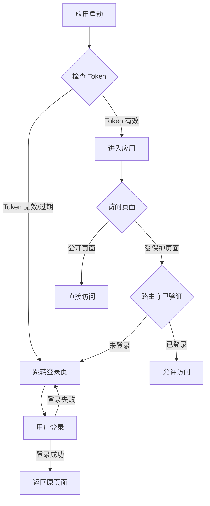
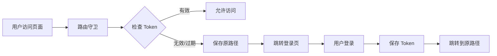

## 产品概述

为现有应用添加完整的身份认证流程，实现基于 Token 的登录状态管理和路由访问控制。

## 核心功能

- **Token 过期检查**：应用启动时自动检查 Token 有效性（7 天有效期）
- **路由守卫**：除登录/注册页外的所有页面需要登录才能访问
- **自动跳转**：未登录或 Token 过期时自动跳转到登录页
- **记住原页面**：登录成功后自动返回用户原本访问的页面
- **持久化登录状态**：配合"记住我"功能实现 7 天内免登录

## 技术选型

- 前端框架：React + TypeScript
- 路由管理：React Router
- 状态管理：React Context API / Redux（视项目现状而定）
- Token 存储：LocalStorage
- HTTP 请求：Axios（配置拦截器）

## 技术架构

### 系统架构



### 模块划分

- **认证服务模块 (AuthService)**
- 职责：Token 验证、登录状态管理、登录/登出操作
- 技术：TypeScript 类封装、LocalStorage API
- 对外接口：`login()`, `logout()`, `isTokenValid()`, `getToken()`, `setToken()`

- **路由守卫模块 (RouteGuard)**
- 职责：拦截路由跳转、验证登录状态、处理重定向逻辑
- 技术：React Router 高阶组件或自定义 Hook
- 依赖：认证服务模块
- 对外接口：`ProtectedRoute` 组件

- **HTTP 拦截器模块 (HttpInterceptor)**
- 职责：自动在请求中添加 Token、处理 401 响应
- 技术：Axios 请求/响应拦截器
- 依赖：认证服务模块
- 对外接口：配置化的 Axios 实例

### 数据流



## 实现细节

### 核心目录结构

```
src/
├── services/
│   └── authService.ts        # 新增：认证服务
├── components/
│   └── ProtectedRoute.tsx    # 新增：路由守卫组件
├── utils/
│   └── httpClient.ts         # 修改：添加拦截器配置
├── hooks/
│   └── useAuth.ts            # 新增：认证状态 Hook
└── App.tsx                   # 修改：添加启动检查逻辑
```

### 关键代码结构

**Token 数据结构**：存储在 LocalStorage 中的认证信息，包含访问令牌和过期时间戳。

```typescript
interface AuthToken {
  token: string;
  expiresAt: number; // Unix 时间戳
}
```

**AuthService 类**：提供核心认证功能，管理 Token 的存储、验证和清理。

```typescript
class AuthService {
  private readonly TOKEN_KEY = 'auth_token';
  private readonly TOKEN_EXPIRY_DAYS = 7;

  setToken(token: string, rememberMe: boolean): void;
  getToken(): string | null;
  isTokenValid(): boolean;
  clearToken(): void;
  login(credentials: LoginCredentials): Promise<void>;
  logout(): void;
}
```

**ProtectedRoute 组件**：高阶组件，包装需要登录才能访问的路由。

```typescript
interface ProtectedRouteProps {
  children: React.ReactNode;
}

const ProtectedRoute: React.FC<ProtectedRouteProps> = ({ children }) => {
  // 检查登录状态
  // 未登录则重定向到登录页，并保存当前路径
};
```

### 技术实现方案

#### 1. Token 过期检查机制

**问题**：如何在应用启动时验证 Token 有效性
**方案**：

- 在 App.tsx 的 useEffect 中执行启动检查
- 比对当前时间与存储的过期时间戳
- 过期则清除 Token 并设置未登录状态
**关键技术**：
- LocalStorage API
- Date.now() 时间戳比对
- React useEffect Hook
**实现步骤**：

1. 从 LocalStorage 读取 Token 和过期时间
2. 比对当前时间与过期时间
3. 若过期则调用 clearToken()
4. 更新全局认证状态
5. 触发路由重定向逻辑

#### 2. 路由守卫实现

**问题**：如何拦截所有受保护路由的访问
**方案**：

- 创建 ProtectedRoute 高阶组件
- 使用 React Router 的 Navigate 组件处理重定向
- 通过 URL 参数传递原访问路径（redirect）
**关键技术**：
- React Router v6 Navigate 组件
- useLocation Hook 获取当前路径
- URLSearchParams 处理查询参数
**实现步骤**：

1. 在 ProtectedRoute 中调用 isTokenValid()
2. 未登录时获取当前路径 pathname
3. 构造登录页 URL：`/login?redirect=${pathname}`
4. 使用 Navigate 组件跳转
5. 登录成功后从 URL 参数读取 redirect 并跳转

#### 3. HTTP 拦截器配置

**问题**：如何自动在所有请求中添加 Token 并处理过期响应
**方案**：

- 配置 Axios 请求拦截器自动添加 Authorization header
- 配置响应拦截器捕获 401 状态码
- 401 时清除 Token 并跳转登录页
**关键技术**：
- Axios interceptors API
- Promise reject 处理
**实现步骤**：

1. 创建 Axios 实例
2. 添加请求拦截器：从 AuthService 获取 Token 并添加到 headers
3. 添加响应拦截器：捕获 401 错误
4. 调用 AuthService.clearToken()
5. 跳转到登录页并保存当前路径

#### 4. 登录后返回原页面

**问题**：登录成功后如何返回用户原本访问的页面
**方案**：

- 通过 URL 查询参数 redirect 传递原路径
- 登录组件中使用 useSearchParams 读取 redirect
- 登录成功后使用 navigate(redirect || '/') 跳转
**关键技术**：
- React Router useSearchParams Hook
- useNavigate Hook
**实现步骤**：

1. 登录页面组件读取 URL 参数 redirect
2. 登录成功后调用 navigate(redirect)
3. 若无 redirect 参数则跳转到默认首页

### 集成要点

- **路由配置**：在 App.tsx 或路由配置文件中，使用 ProtectedRoute 包装所有受保护路由
- **全局状态**：考虑使用 Context API 提供全局认证状态（isAuthenticated, user 等）
- **错误处理**：网络错误时应友好提示，避免频繁跳转登录页
- **安全性**：Token 不应包含敏感信息，建议使用 JWT 并在后端验证

## 技术考量

### 日志记录

- 遵循项目现有日志规范
- 记录登录/登出事件
- 记录 Token 过期事件
- 记录路由拦截事件

### 性能优化

- 减少 LocalStorage 读写频率（使用内存缓存）
- 路由守卫避免重复检查（使用 useMemo）
- Token 验证使用同步方法（避免异步等待）

### 安全措施

- Token 存储在 LocalStorage（XSS 风险需前端代码审查）
- HTTPS 传输（确保生产环境启用）
- Token 刷新机制（可选：静默刷新避免用户感知过期）
- 敏感操作二次验证

### 扩展性

- 支持多种认证方式（OAuth、SSO）的扩展接口
- 支持 Token 刷新机制的预留设计
- 支持权限控制的扩展（角色、权限级别）

## Agent Extensions

### SubAgent

- **code-explorer**
- 用途：探索项目现有的路由配置、认证相关代码和 HTTP 请求配置，确保新增功能与现有代码架构兼容
- 预期结果：识别现有的路由结构、认证服务（如有）、HTTP 客户端配置，为实现方案提供上下文信息