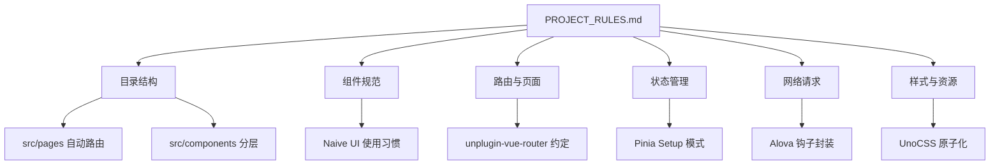

## 产品概述

在项目 `docs` 目录下创建 `PROJECT_RULES.md` 文档，旨在为基于 Vue 3 + Naive UI + Alova 的技术栈提供统一的开发规范指南，确保团队协作的代码一致性和项目结构的整洁。

## 核心内容

- **目录结构规范**：定义 `src` 下各模块（components, pages, store, hooks, assets 等）的职能分配。
- **组件开发规范**：明确 Vue 3 Composition API (Script Setup) 的编写习惯、Naive UI 组件的使用建议以及组件命名规则。
- **页面与路由规范**：基于 `unplugin-vue-router` 的自动路由逻辑，说明页面文件布局与路由参数定义方式。
- **状态管理与数据流**：规定 Pinia Store 的定义规范及 Alova 请求模块的封装与调用方式。
- **样式与资源规范**：说明 UnoCSS 的使用准则、静态资源管理以及图标（Iconify）的使用方式。

## 技术栈背景

- **核心框架**：Vue 3 (SFC, Script Setup) + TypeScript
- **UI 框架**：Naive UI
- **状态管理**：Pinia
- **请求层**：Alova
- **样式方案**：UnoCSS
- **构建插件**：unplugin-auto-import, unplugin-vue-components, unplugin-vue-router

## 系统架构（文档结构）

## Agent Extensions

### SubAgent

- **code-explorer**
- Purpose: 深入探索当前项目的实际代码结构、命名习惯及 Alova/Pinia 的具体实现方式。
- Expected outcome: 获取最真实的项目现状，确保编写的规范文档与现有代码高度契合。

### MCP

- **Sequential Thinking MCP Server**
- Purpose: 系统性地规划文档的目录大纲和每一章节的核心要点。
- Expected outcome: 生成逻辑严密、覆盖全面的规范文档大纲。
- **Windows CLI MCP Server**
- Purpose: 执行目录检查及文档文件的创建操作。
- Expected outcome: 确保 docs 目录存在并成功创建 PROJECT_RULES.md 文件。