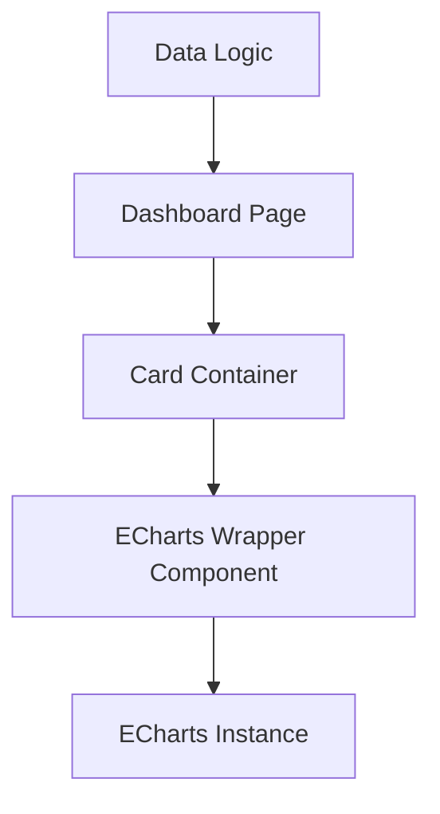

## 产品概览

更新仪表盘（Dashboard）的用户界面，旨在提升视觉一致性并增强数据可视化效果。通过统一卡片圆角风格和引入高性能图表库 ECharts，提供更现代、专业的监控体验。

## 核心功能

- **UI 风格统一**：将仪表盘中所有功能卡片和布局容器的圆角调整为 16px，建立圆润、现代的视觉语言。
- **图表系统升级**：弃用原有的趋势图方案，集成 ECharts。
- **ECharts 折线图实现**：实现平滑的趋势折线图，支持数据悬浮提示（Tooltip）、响应式缩放以及自定义主题色。
- **交互优化**：确保新图表在不同尺寸卡片内均能自适应展示，并保持高性能渲染。

## 技术栈

- **前端框架**: Vue 3 (Composition API)
- **图表库**: ECharts 5.x
- **样式处理**: Tailwind CSS
- **构建工具**: Vite

## 技术架构

### 系统架构

- **展示层**: Vue 组件负责渲染，通过 Props 接收数据。
- **逻辑层**: 封装 ECharts 初始化、销毁及 Resize 监听逻辑。
- **样式层**: Tailwind CSS 处理基础布局与圆角规范。



### 模块划分

- **ECharts Wrapper**: 统一封装 ECharts 的生命周期管理，提供 `options` 响应式更新。
- **UI Components**: 更新全局卡片样式或原子 CSS 配置。

## 实现细节

### 核心目录结构

```
project-root/
├── src/
│   ├── components/
│   │   └── dashboard/
│   │       └── TrendChart.vue    # 新增：基于 ECharts 的折线图组件
│   ├── views/
│   │   └── Dashboard.vue         # 修改：更新布局样式与组件引用
│   └── styles/
│       └── variables.css         # 修改：定义全局圆角规范（若存在）
```

### 关键代码结构

**ECharts 配置结构**:

```typescript
interface ChartOptions {
  xAxis: object;
  yAxis: object;
  series: Array<{
    type: 'line';
    smooth: boolean;
    data: number[];
    areaStyle?: object;
  }>;
}
```

### 技术实施方案

1. **依赖安装**: 使用 `npm` 或 `pnpm` 安装 `echarts`。
2. **样式重构**: 在全局样式文件或 Tailwind 配置中定义 `rounded-2xl` (16px) 的应用范围。
3. **组件开发**: 开发 `TrendChart.vue`，处理 `resize` 事件以保证在 Tauri 窗口缩放时图表不失真。

## 设计风格

采用现代极简风格，强调层次感和交互呼吸感。

- **卡片设计**：背景使用纯白或极浅灰，配合 16px 大圆角和微弱投影，营造悬浮感。
- **图表视觉**：折线图使用平滑曲线，主色调采用品牌蓝，下方填充淡蓝色渐变层，增强视觉饱满度。
- **排版布局**：加大卡片间距，确保在不同屏幕分辨率下都有足够的留白。

## Agent Extensions

### SubAgent

- **code-explorer**
- Purpose: 定位当前项目中仪表盘页面文件、卡片组件定义以及现有趋势图的实现逻辑。
- Expected outcome: 明确需要修改的 Vue 文件路径、样式类名以及现有图表的数据结构。