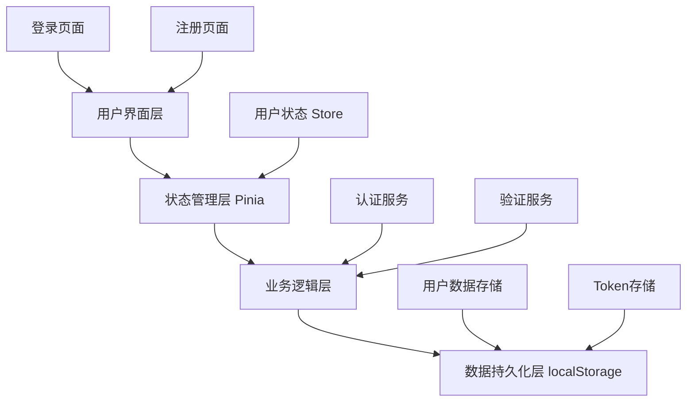
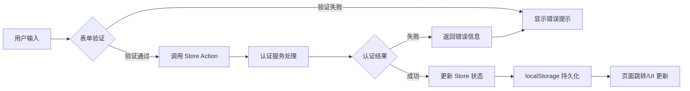

## 产品概述

一个完整的前端用户认证系统，支持用户注册和登录功能。系统使用纯前端技术实现，无需后端服务，所有数据存储在浏览器的 localStorage 中。

## 核心功能

- **用户注册**：新用户可以创建账户，输入用户名、密码和确认密码
- **用户登录**：已注册用户可以使用用户名和密码登录系统
- **状态管理**：使用 Pinia 管理用户登录状态和用户信息
- **持久化存储**：用户数据和登录状态通过 localStorage 持久化保存
- **表单验证**：对用户输入进行前端校验，包括用户名格式、密码强度、密码匹配等
- **登出功能**：用户可以安全登出，清除登录状态

## 技术栈选择

- **前端框架**：Vue 3 + TypeScript
- **状态管理**：Pinia
- **存储方案**：localStorage
- **密码加密**：crypto-js (SHA-256)
- **表单验证**：自定义验证逻辑

## 技术架构

### 系统架构

本项目采用分层架构，确保代码的可维护性和扩展性：



### 模块划分

**1. 认证 Store 模块 (auth.store.ts)**

- 职责：管理用户登录状态、用户信息、认证令牌
- 技术：Pinia
- 依赖：认证服务模块
- 接口：login(), register(), logout(), checkAuth()

**2. 认证服务模块 (authService.ts)**

- 职责：处理用户注册、登录、登出的核心业务逻辑
- 技术：TypeScript + crypto-js
- 依赖：LocalStorage 管理模块
- 接口：authenticateUser(), registerUser(), validateCredentials()

**3. LocalStorage 管理模块 (storageService.ts)**

- 职责：封装 localStorage 操作，提供类型安全的存储接口
- 技术：TypeScript
- 依赖：无
- 接口：saveUser(), getUser(), getUsers(), saveToken(), getToken(), clear()

**4. 表单验证模块 (validation.ts)**

- 职责：提供通用的表单验证规则和方法
- 技术：TypeScript
- 依赖：无
- 接口：validateUsername(), validatePassword(), validatePasswordMatch()

### 数据流



## 实现细节

### 核心目录结构

```
src/
├── stores/
│   └── auth.ts              # 新增：用户认证 Pinia Store
├── services/
│   ├── authService.ts       # 新增：认证业务逻辑服务
│   └── storageService.ts    # 新增：localStorage 封装服务
├── types/
│   └── auth.ts              # 新增：认证相关 TypeScript 类型定义
└── utils/
    └── validation.ts        # 新增：表单验证工具函数
```

### 关键代码结构

**User 接口**：定义用户实体的核心数据结构，包含用户的唯一标识、认证凭据和时间戳信息。

```typescript
interface User {
  id: string;
  username: string;
  passwordHash: string;
  createdAt: number;
}
```

**AuthState 接口**：定义认证状态的数据结构，用于 Pinia Store 管理全局认证状态。

```typescript
interface AuthState {
  isAuthenticated: boolean;
  currentUser: User | null;
  token: string | null;
}
```

**AuthService 类**：提供认证服务的核心业务逻辑，处理用户注册、登录验证和密码加密等功能。

```typescript
class AuthService {
  register(username: string, password: string): Promise<{ success: boolean; message: string }>;
  login(username: string, password: string): Promise<{ success: boolean; user?: User; token?: string; message: string }>;
  hashPassword(password: string): string;
}
```

**useAuthStore 函数**：Pinia Store 的核心函数，提供认证相关的状态和操作方法。

```typescript
function useAuthStore() {
  const state: AuthState;
  const actions: {
    register(username: string, password: string): Promise<void>;
    login(username: string, password: string): Promise<void>;
    logout(): void;
    checkAuth(): void;
  };
}
```

### 技术实现方案

#### 1. 密码安全存储

**问题**：密码不能明文存储在 localStorage 中
**解决方案**：使用 crypto-js 的 SHA-256 算法对密码进行哈希加密
**实现步骤**：

1. 安装 crypto-js 依赖包
2. 在认证服务中实现 hashPassword 方法
3. 注册时存储哈希后的密码
4. 登录时对比哈希后的密码
5. 使用盐值（salt）增强安全性（可选）

**测试策略**：验证相同密码生成相同哈希值，不同密码生成不同哈希值

#### 2. 认证令牌生成

**问题**：需要生成唯一的认证令牌标识用户会话
**解决方案**：使用 UUID 或时间戳+随机数组合生成唯一 token
**实现步骤**：

1. 登录成功后生成唯一 token
2. 将 token 存储在 localStorage
3. 在 Pinia Store 中维护 token 状态
4. 页面刷新时通过 token 恢复登录状态

**测试策略**：验证 token 唯一性，测试 token 持久化和恢复

#### 3. 状态持久化和恢复

**问题**：页面刷新后需要保持登录状态
**解决方案**：在应用初始化时从 localStorage 读取 token 并验证
**实现步骤**：

1. 在 App.vue 或 main.ts 中调用 checkAuth()
2. checkAuth() 从 localStorage 读取 token
3. 根据 token 恢复用户信息到 Store
4. 如果 token 无效，清除 Store 状态

**测试策略**：刷新页面验证登录状态是否保持

#### 4. 表单验证逻辑

**问题**：需要对用户输入进行前端校验
**解决方案**：实现可复用的验证函数
**实现步骤**：

1. 创建 validation.ts 工具文件
2. 实现 validateUsername：检查长度和字符规则
3. 实现 validatePassword：检查密码强度
4. 实现 validatePasswordMatch：确认密码一致性
5. 在组件中调用验证函数并显示错误信息

**测试策略**：测试各种边界情况和非法输入

### 集成点

- **Pinia Store 与组件集成**：组件通过 useAuthStore() 获取状态和方法
- **localStorage 与 Store 同步**：每次状态变更自动同步到 localStorage
- **路由守卫集成**：在路由配置中添加导航守卫，检查认证状态
- **表单验证集成**：在表单提交前调用验证函数，阻止非法提交

## 技术考量

### 性能优化

- localStorage 读写操作使用节流，避免频繁 I/O
- Pinia Store 使用 computed 缓存派生状态
- 表单验证使用防抖，减少实时验证次数

### 安全措施

- 密码使用 SHA-256 哈希加密存储
- 用户名限制特殊字符，防止注入攻击
- 密码强度要求：至少 6 位，包含字母和数字
- 登录失败提示使用通用信息，避免用户名枚举

### 可扩展性

- 认证服务设计为可替换架构，未来可轻松迁移到后端 API
- 存储服务抽象化，可快速切换到 sessionStorage 或 IndexedDB
- 验证规则可配置化，支持动态调整验证策略